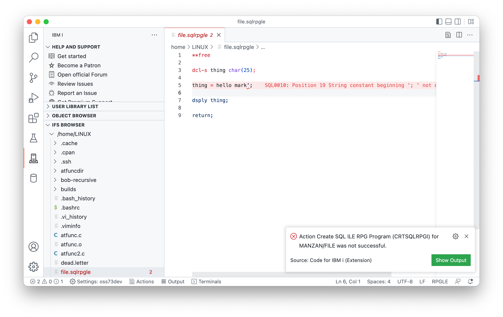
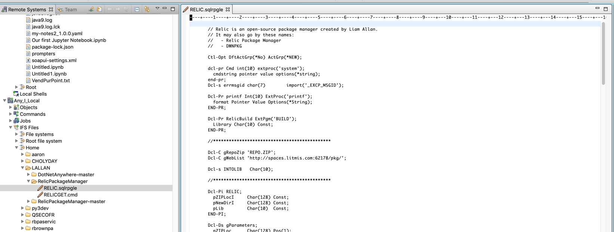

# Tooling

This chapter is going to be about getting the tooling required for development in the IFS and to use the SSH shell correctly. This is needed because in order to use tools, like `git` and `gmake`, you should have a correctly setup system.

## Using SSH

To access any of the open-source tools like `git` and `yum`, you should SSH into your IBM i. To enable to SSH server on your IBM i, you can run the following commands:

* `STRTCPSVR SERVER(*SSHD)` to start the server.
* `ENDTCPSVR SERVER(*SSHD)` to end the server.

Next, you will need an SSH client to connect to your system.

* Mac OS will ship with an SSH client, which you can access via Terminal or another shell.
* On Windows:
   * Putty: https://www.putty.org/
   * Git for Windows comes with an SSH client: https://gitforwindows.org/

When you have your SSH clients setup, you can use `ssh user@yoursystem` to connect to the pase environment. If your user profile is longer than 8 chartacters long, you will be denied access.

## What is yum?

yum is a package manager which has been ported to IBM i. The intention behind yum was to replace the 5333OPS PTF group, which used to contain the open source tools such a `git`, `bash` and so on. With yum, you are now able to install those packages via the pase command line (and also Access Client Solutions).

There are multiple ways to install yum. 

### Installing with Access Client Solutions (ACS)

1. Download the latest release of Access Client Solutions
2. Access the Open Source Package Management Interface through the "Tools" Menu of ACS

## Before using yum / Setting up your home directory

Before anyone starts to use yum, git, ssh, etc, on your IBM i, it should be made clear that each user needs to setup their home directory in their user profile settings. Each user gets a home directory, which is where they would develop any code they write on the IBM i. It will be used in future chapters.

To change the user profile, firstly make a directory in the `/home` folder (which is in the root) which matches the name of their user profile. Case does not matter. The following are the commands which should be used from a 5250 session. For example, if my user name was `BARRY`.

```
MKDIR DIR('/home/BARRY')
CHGUSRPRF USRPRF(BARRY) HOMEDIR('/home/BARRY')
```

## Using yum

`yum` and the packages it install will install in `/QOpenSys/pkgs` (more specifically `/QOpenSys/pkgs/bin`). This means, in order to use `yum` you need to adjust your `$PATH` variable.

You can do it for your current SSH session using.

```
PATH=/QOpenSys/pkgs/bin:$PATH
```

You can do it permanently by appending that line to your users `.profile`, which is executed when you launch an SSH session.

```
echo PATH=/QOpenSys/pkgs/bin:$PATH >> $HOME/.profile
```

You may also want to launch `bash` when you start your session, in which you can just change your `.profile` for.


```
echo PATH=/QOpenSys/pkgs/bin:$PATH bash >> $HOME/.profile
```

When you install packages, only one user needs to install it as the `/QOpenSys/pkgs` directory is shared by everyone.

### General `yum` commands

* Install a package: `yum install <package>`
* Remove a package: `yum remove <package>`
* Search for a package: `yum search <package>`
* List installed packages: `yum list installed`
* List available packages: `yum list available`
* List all packages: `yum list all`

### Installing other tools

To install git, bob, GNU Make, we must use the `yum` command once you have it setup.

```
yum install git.ppc64 make-gnu.ppc64 bob.ppc64
```

After this, the `git`, `gmake` and `makei` command will be available for your users to use.

## Tools for editing streamfiles

Of course, since all future development will take place in the IFS (that includes for RPG, COBOL, or any ILE language you use) you will need to use a sufficient editor. This section will cover different editors available for editing source code on the IFS.

### Visual Studio Code

Code for IBM i is an extension available for VSC. You can install it from the [Marketplace](https://marketplace.visualstudio.com/items?itemName=HalcyonTechLtd.ibm-i-development-pack) and once connected to a remote system, you will be able to work with your IBM i. It is completely free.



### Rational Developer for i

Rational Developer for i (RDi) does have an IFS Browser where you can edit and compile ILE sources.



Of course, from RDi, you can only compile sources from the IFS that have support for the `SRCSTMF` parameter. In RDi, like usual, you can setup your library list for the job that the source will compile under.