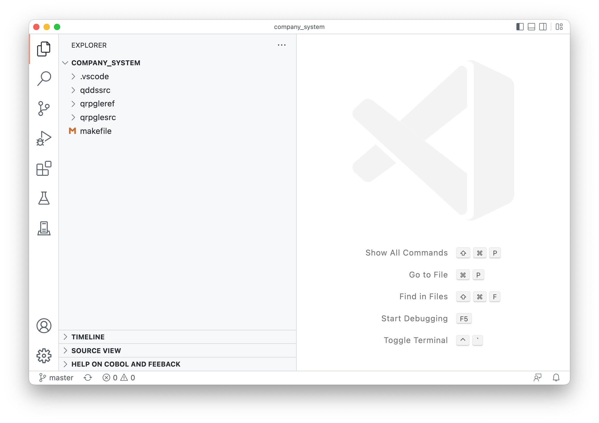
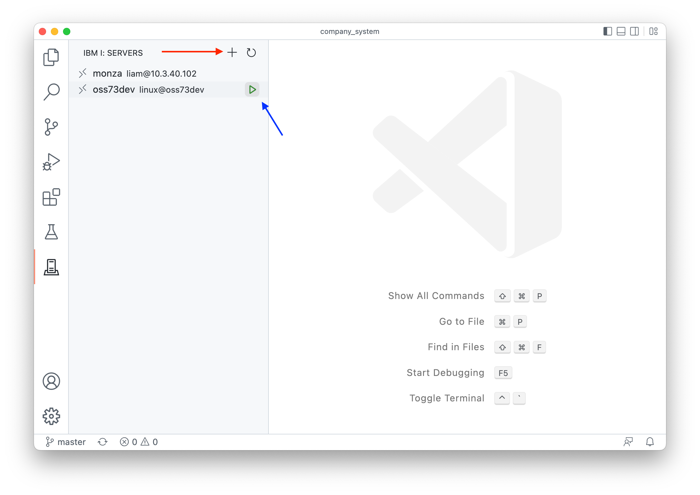
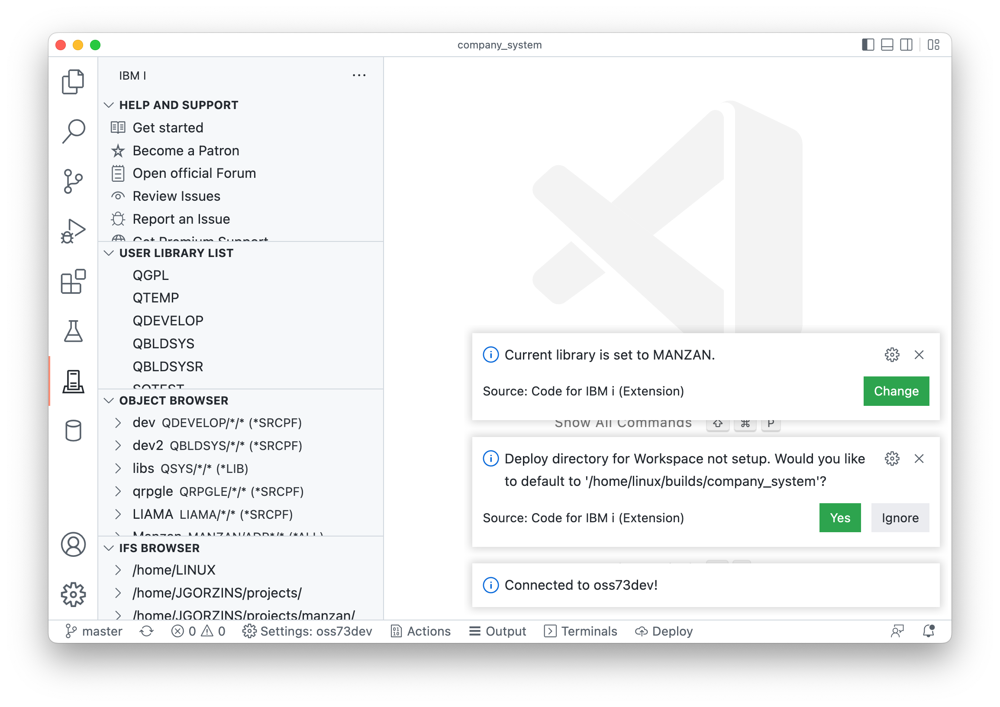
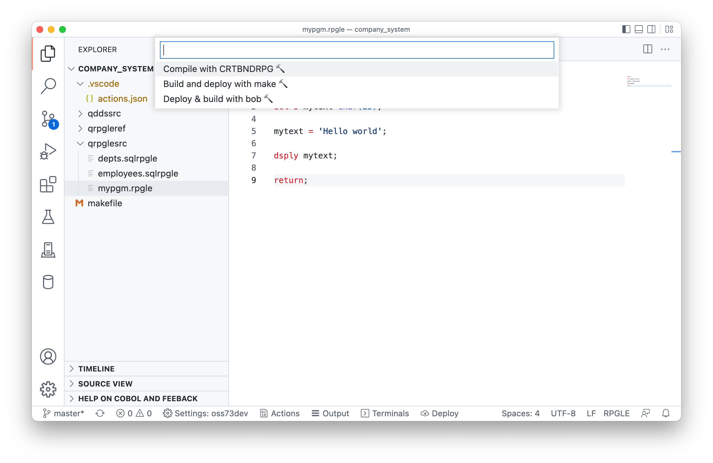
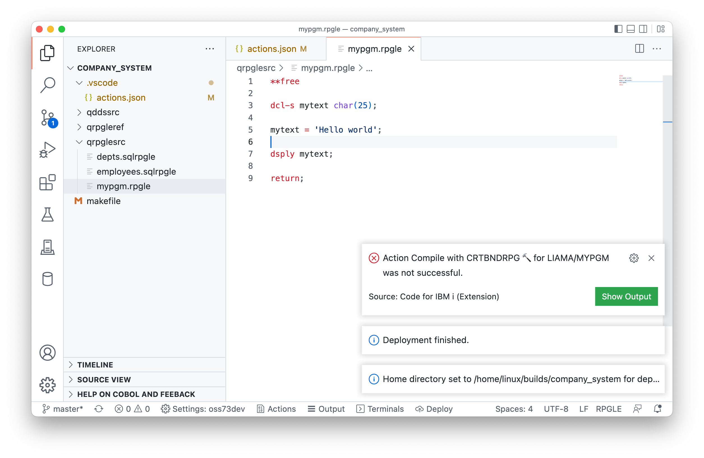
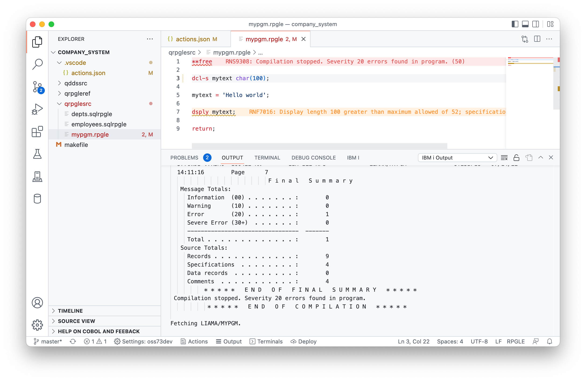
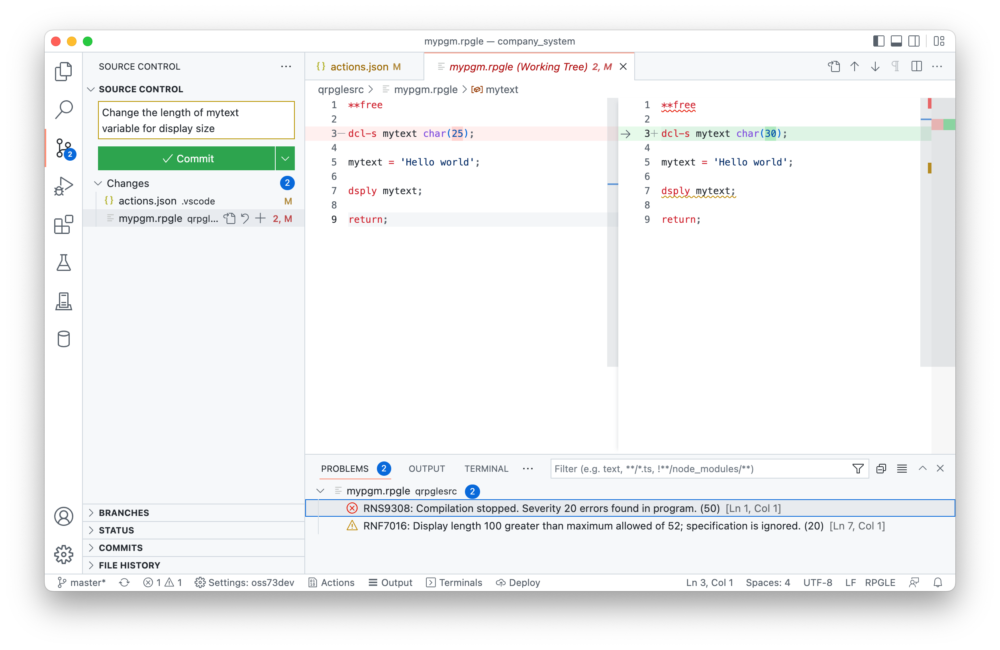

# Developing with Visual Studio Code

In this section, we will cover the steps needed to setup the development environment in Visual Studio Code.

* Install [Visual Studio Code](https://code.visualstudio.com) (it's free!)
* Install the [IBM i Development Pack](https://marketplace.visualstudio.com/items?itemName=HalcyonTechLtd.ibm-i-development-pack). This is what allows you to connect to IBM i.

[//]: # "```mermaid"
[//]: # "stateDiagram-v2"
[//]: # "    direction LR"
[//]: # "    Clone: Clone repository"
[//]: # "    VSCode: Visual Studio Code"
[//]: # "    Code: Write code"
[//]: # "    IBMi: IBM i"
[//]: # "    [*] --> Clone"
[//]: # "    Clone --> VSCode: Open in VS Code"
[//]: # "    VSCode --> IBMi: Connect to IBM i"
[//]: # "    IBMi --> Code"
[//]: # "```"


# Getting the repo

Next, you should **clone your code repository to your local machine** (not your IBM i!). There are many ways to do it. If you're new to git, you should use a git client like GitHub Desktop. This makes cloning repos for GitHub really simple after you sign into your GitHub account.

For this example, I am using the company_system repo, which is free and open-source. After I have cloned it, I open it up in VS Code.

```
barrymac:Repos barry$ git clone git@github.com:worksofliam/company_system.git
Cloning into 'company_system'...
remote: Enumerating objects: 59, done.
remote: Counting objects: 100% (59/59), done.
remote: Compressing objects: 100% (40/40), done.
remote: Total 59 (delta 21), reused 52 (delta 14), pack-reused 0
Receiving objects: 100% (59/59), 9.03 KiB | 3.01 MiB/s, done.
Resolving deltas: 100% (21/21), done.
barrymac:Repos barry$ cd company_system
barrymac:Repos barry$ code .
```

You can also open the repository up in VS Code by selected File -> Open Folder.

# Working with Visual Studio Code

## Getting connected

If you opened the folder correctly, you should see the directories from the Explorer in VS Code like in the screenshot below.



The next step is to get connect to the system where you want to compile your code. Head over to the Code for IBM i tab and either connect to a new system (red arrow) or connect to an existing one (blue arrow).



The first time you connect with a folder / workspace open, it will give you two notices.

* What your current library is. You can click Change to change it to the library you want to build your objects in. This is usually your own developer library.
* If you'd like to use a default location to upload your local sources to (the 'Deploy directory'). It defaults a `builds` folder in the standard home directory for a user. You should select Yes. You can change this later if you wanted to.



## Creating an `actions.json` file

The `actions.json` file defines what commands should be used to build your application. It belongs in the `.vscode` folder.

The company_system repository comes with an existing one that uses `gmake` (GNU Make) to build the application, but you could also set up an action to:

* run `gmake`
* run `makei` (ibmi-bob)
* run the `CRTBNDxxx` directory

**You do not need a build tool** like ibmi-bob or GNU Make to compile programs.

You also have access to some variables in the command:

* `&CURLIB` and `&BUILDLIB` is the current library as setup in VS Code
* `&RELATIVEPATH` is the path to the source being compiled
* `&BASENAME` for the name and extension of the file
* `&NAME` for just the name, useful for object parameter
* `&USERNAME` for the currently signed in username

For the errors (EVFEVENT) to be returned for the compile on the active source, `*EVENTF` must be in the command string. Notice below that `deployFirst` is set to `true` on all Actions. This is to make sure source code gets uploaded to the Deploy directory before the Action is run.

#### Running an ILE command

```json
  {
    "name": "Compile with CRTBNDRPG 🔨",
    "command": "CRTBNDRPG PGM(&CURLIB/&NAME) SRCSTMF('&RELATIVEPATH') OPTION(*EVENTF) DBGVIEW(*SOURCE) TGTRLS(*CURRENT)",
    "environment": "ile",
    "deployFirst": true,
    "extensions": [
      "RPGLE"
    ]
  }
```

#### Running a pase command (make)

**Note:** this would build the entire project.

```json
  {
    "name": "Build and deploy with make 🔨",
    "command": "/QOpenSys/pkgs/bin/gmake BIN_LIB=&CURLIB OPT=*EVENTF",
    "environment": "pase",
    "deployFirst": true,
    "extensions": [
      "GLOBAL"
    ]
  }
```

#### Running a pase command (ibmi-bob)

**Note:** this would build the entire project. Look into use `makei compile` to build a single source.

```json
  {
    "name": "Deploy & build with bob 🔨",
    "command": "OPT=*EVENTF BUILDLIB=&CURLIB /QOpenSys/pkgs/bin/makei build",
    "extensions": [
      "GLOBAL"
    ],
    "environment": "pase",
    "deployFirst": true
  }
```

## Running an Action / compiling code

You can use the Control / Command + E shortcut to run an Action when you have opened some source code. This will prompt all available Actions for the current source.



Selecting an Action with `deployFirst` as `true` will ask you which files you want to deploy:

* All: deploy all sources from my local machine
* Working changes: deploy my working changes (when git is used)
* Staged changes: deploy my staged changes (when git is used)

You should do 'All' for the first time, and then when you're confident the source is on the server you can use Working or Staged changes.



You can see what happened from the Action being run here:

1. it set the working home directory to the Deploy directory on the IFS
2. It uploaded files to that directory
3. It failed to run the command. You can click on Show Output to see the job log and spool file if there is one.



If there are any source errors, you will see them appear in the editor. **This requires \*EVENTF on the Action command**.

## Using git in Visual Studio Code

Visual Studio Code has an excellent git client to go along with it. Because you are developing on the local machine, it means you can use the great git tools available.



# Extra tips

* If you have tn5250 installed on the connected IBM i, you can launch a terminal inside of Visual Studio Code. Find the Terminal button on the status bar below and click on it. It will let you select a PASE or 5250 shell.
* To run an SQL statement, open a new file (Control / Command + N) and change the language to SQL. In the top right of the document, you should see a play button which will execute the statement at your cursor.
* See the [Code for IBM i documentation](https://halcyon-tech.github.io/vscode-ibmi/#/).
* Watch this as a [video tutorial](https://www.youtube.com/watch?v=XuiGyWptgDA&t=425s)